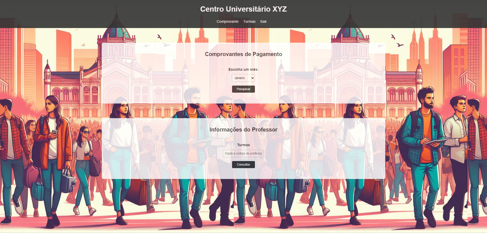
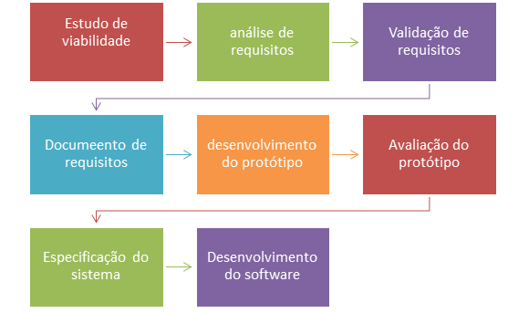

# PROJETO INTEGRADOR PROGRAMAÇÃO ORIENTADA A OBJETO

## SISTEMA DE GERENCIAMENTO DO CENTRO UNIVERSITARIO XYZ.

#### OBJETIVO:
Representar o prototipo de um sistema de gerenciamento para um centro universitário, para isso foi criado um website com as funcionalidades de login e cadastro de alunos, docentes, colaboradores e fornecedores.

#### Integrantes:
* *[Elineides Santos Silva](https://github.com/elineides)*
* *[Joao Ricardo Fortunato Silva](https://github.com/Ricardo-Forttunato)*
* *[José Roberto da Silva](https://github.com/pilotjrs)*
* *[Lucas do Carmo Freitas Santos](https://github.com/Lucas-cfs)*
* *[Luís Miguel Medeiros Raunhette](https://github.com/LuisMMRaunheitte)*
* *[Mariana Dias Oliveira](https://github.com/Mariree003)*
* *[Victor Macedo Pereira](https://github.com/vvctormacedo)*

## PROTOTIPAGEM DA INTERFACE DO SISTEMA 

#### Pagina Principal do Centro Universitario XYZ
>
>Janela de apresentação da organização  
>Link para o Prototipo 1: [Pagina Principal](https://ricardo-forttunato.github.io/projetoIntegradorPoo-Senac/)

#### Pagina de login do Centro Universitario XYZ
>
>Janela de logon do Centro Universitario XYZ  
>Link para o Prototipo 2: [Pagina de Login ](https://ricardo-forttunato.github.io/projetoIntegradorPoo-Senac/frontend/src/pages/login.html)
 

#### Pagina de cadastro do Centro Universitario XYZ
>
>Janela de cadastro do Centro Universitario XYZ  
>Link para o Prototipo 3: [Pagina de cadastro](https://ricardo-forttunato.github.io/projetoIntegradorPoo-Senac/frontend/src/pages/cadastro.html)

#### Pagina de cadastro opção 1 cadastro de Alunos
>
>Janela de cadastro seção de alunos  
>Link para o Prototipo 4: [Pagina de Cadastro Alunos](https://ricardo-forttunato.github.io/projetoIntegradorPoo-Senac/frontend/src/pages/cadastro.html)

#### Pagina de cadastro opção 2 cadastro de Docentes
>
>Janela de cadastro seção de docentes  
>Link para o Prototipo 5: [Pagina de Cadastro Docente](https://ricardo-forttunato.github.io/projetoIntegradorPoo-Senac/frontend/src/pages/cadastro.html)

#### Pagina de cadastro opção 5 cadastro de Fornecedores
>
>Janela de cadastro seção de fornecedores  
>Link para o Prototipo 6: [Pagina de Cadastro Fornecedor](https://ricardo-forttunato.github.io/projetoIntegradorPoo-Senac/frontend/src/pages/cadastro.html)

#### Pagina de acesso as funcionalidades do aluno
>
>Janela para as funcionalidades de Dicente  
>Link para o Prototipo 7: [Pagina do Aluno](https://ricardo-forttunato.github.io/projetoIntegradorPoo-Senac/frontend/src/pages/Usuario.html)

#### Pagina de acesso as funcionalidades do professor
>
>Janela para as funcionalidades de Docente  
>Link para o Prototipo 8: [Pagina do PRofessor](https://ricardo-forttunato.github.io/projetoIntegradorPoo-Senac/frontend/src/pages/professor.html)

#### Pagina de acesso as funcionalidades dos colaboradores da instituição
>
>Janela para as funcionalidades de Colaboradores  
>Link para o Prototipo 9: [Pagina dos Colaboradores](https://ricardo-forttunato.github.io/projetoIntegradorPoo-Senac/frontend/src/pages/colaborador.html)

#### Pagina de acesso as funcionalidades de Fornecedores
>
>Janela para as funcionalidades de Fornecedores  
>Link para o Prototipo 10: [Pagina dos Fornecedores](https://ricardo-forttunato.github.io/projetoIntegradorPoo-Senac/frontend/src/pages/fornecedor.html)

  

#### FLUXOGRAMA

 _Local do arquivo: NA_

#### DIAGRAMA DE CASO DE USO

 _Local do arquivo: assets/doc/Diagrama de casos UML.docx_ 

#### DIAGRAMA DE CLASSES

 _Local do arquivo: assets/doc/projetointegrador-diagrama de classe.asta_
