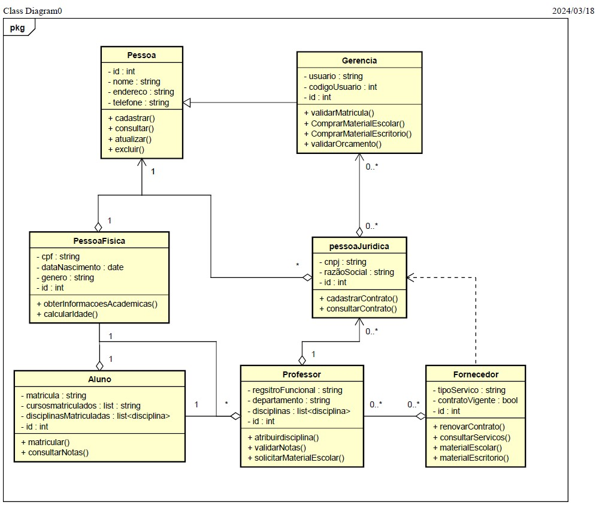

# PROJETO INTEGRADOR PROGRAMAÇÃO ORIENTADA A OBJETO

## SISTEMA DE GERENCIAMENTO DO CENTRO UNIVERSITARIO XYZ.

#### OBJETIVO:
Representar o prototipo de um sistema de gerenciamento para um centro universitário, para isso foi criado um website com as funcionalidades de login e cadastro de alunos, docentes e fornecedores.

#### Integrantes:
* *[Elineides Santos Silva](https://github.com/elineides)*
* *[Joao Ricardo Fortunato Silva](https://github.com/Ricardo-Forttunato)*
* *[José Roberto da Silva](https://github.com/pilotjrs)*
* *[Lucas do Carmo Freitas Santos](https://github.com/Lucas-cfs)*
* *[Luís Miguel Medeiros Raunhette](https://github.com/LuisMMRaunheitte)*
* *[Mariana Dias Oliveira](https://github.com/Mariree003)*
* *[Victor Macedo Pereira](https://github.com/vvctormacedo)*

## PROTOTIPAGEM DA INTERFACE DO SISTEMA 

#### *Tela Principal do Centro Universitario XYZ*

Tela de apresentação da organização
Link para o Prototipo 1: [Prototipo 1 ](https://ricardo-forttunato.github.io/projetoIntegradorPoo-Senac/)

#### *Tela de login do Centro Universitario XYZ*

Tela de login do Centro Universitario XYZ
Link para o Prototipo 1: [Prototipo 2 ](https://ricardo-forttunato.github.io/projetoIntegradorPoo-Senac/frontend/src/pages/login.html)

#### *Tela de cadastro do Centro Universitario XYZ*

Tela de cadastro do Centro Universitario XYZ
Link para o Prototipo 3: [Prototipo 3 ](https://ricardo-forttunato.github.io/projetoIntegradorPoo-Senac/frontend/src/pages/cadastro.html)

#### *Tela de cadastro opção 1 cadastro de Alunos*

Tela de cadastro seção de alunos
Link para o Prototipo 4: [Prototipo 4 ](https://ricardo-forttunato.github.io/projetoIntegradorPoo-Senac/frontend/src/pages/cadastro.html)

#### *Tela de cadastro opção 2 cadastro de Docentes*

Tela de cadastro seção de docentes
Link para o Prototipo 5: [Prototipo 5 ](https://ricardo-forttunato.github.io/projetoIntegradorPoo-Senac/frontend/src/pages/cadastro.html)

#### *Tela de cadastro opção 5 cadastro de Fornecedores*

Tela de cadastro seção de fornecedores
Link para o Prototipo 6: [Prototipo 6 ](https://ricardo-forttunato.github.io/projetoIntegradorPoo-Senac/frontend/src/pages/cadastro.html)

  

#### FLUXOGRAMA

 _Local do arquivo: assets/_

#### DIAGRAMA DE CASO DE USO

 _Local do arquivo: assets/doc/Diagrama de casos UML.docx_ 

#### DIAGRAMA DE CLASSES

 _Local do arquivo: assets/doc/projetointegrador-diagrama de classe.asta_
