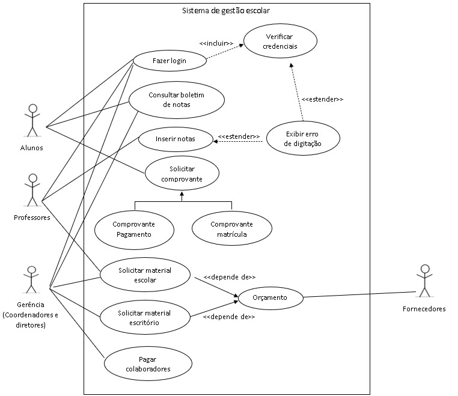

# PROJETO INTEGRADOR PROGRAMAÇÃO ORIENTADA A OBJETO

## SISTEMA DE GERENCIAMENTO DO CENTRO UNIVERSITARIO XYZ.

#### OBJETIVO:
Representar o prototipo de um sistema de gerenciamento para um centro universitário utilizando ferramentas de design (nome da ferramenta)

#### Integrantes:
* *[Elineides Santos Silva](https://github.com/elineides)*
* *[Joao Ricardo Fortunato Silva](https://github.com/Ricardo-Forttunato)*
* *[José Roberto da Silva](https://github.com/pilotjrs)*
* *[Lucas do Carmo Freitas Santos](https://github.com/Lucas-cfs)*
* *[Luís Miguel Medeiros Raunhette](https://github.com/LuisMMRaunheitte)*
* *[Mariana Dias Oliveira](https://github.com/Mariree003)*
* *[Victor Macedo Pereira](https://github.com/vvctormacedo)*

#### FLUXOGRAMA

 _Local do arquivo: assets/_

#### DIAGRAMA DE CASO DE USO

 _Local do arquivo: assets/doc/Diagrama de casos UML.docx_ 

#### DIAGRAMA DE CLASSES

 _Local do arquivo: assets/src/projetointegrador-diagrama de classe.asta_

## PROTOTIPAGFGEM DA INTERFACE DO SISTEMA 

#### *Prototipo1*

Descrição do Prototipo 1
Link para o Prototipo 1: [Prototipo 1 ](https://www.Prototipo1)

#### *Prototipo 2*

Descrição do Prototipo 2
Link para o Prototipo 1: [Prototipo 1 ](https://www.Prototipo2)

#### *Prototipo 3*

Descrição do Prototipo 3
Link para o Prototipo 3: [Prototipo 1 ](https://www.Prototipo3)

#### *Prototipo 4*

Descrição do Prototipo 4
Link para o Prototipo 4: [Prototipo 1 ](https://www.Prototipo4)

#### *Prototipo 5*

Descrição do Prototipo 5
Link para o Prototipo 5: [Prototipo 1 ](https://www.Prototipo5)
