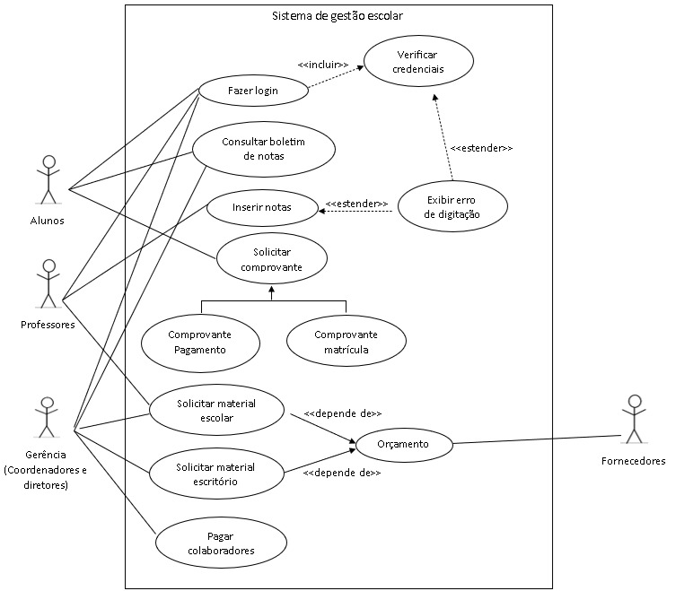
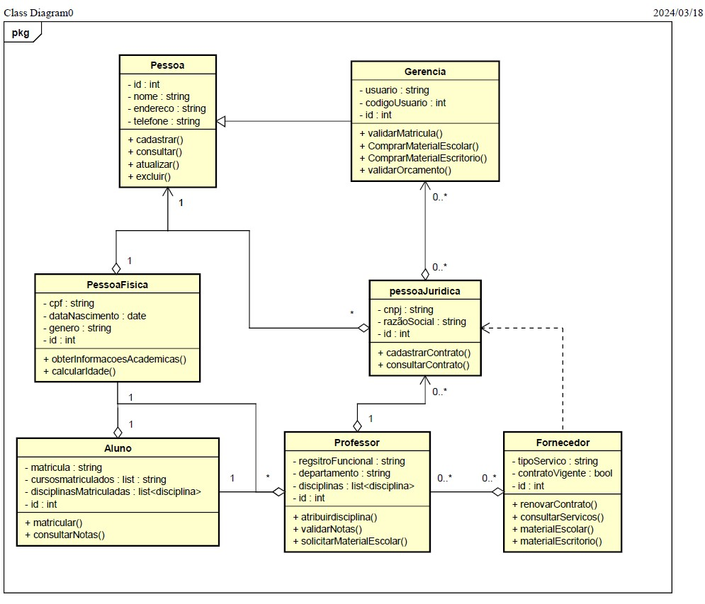

*__Nesta seção, adicionadas as imagens dos arquivos relacionados a primeira entrega do Projeto Integrador Programação Orientada a Ojetos.__*

# Projeto integrador 1º entrega

### *fluxograma.*

_Local do arquivo: assets/_

### *Diagrama de caso de uso.*

_Local do arquivo: assets/doc/Diagrama de casos UML.docx_ 

### *Diagrama de classes realizado na plataforma Astah*

_Local do arquivo: assets/src/projetointegrador-diagrama de classe.asta_

# Projeto integrador 2º entrega

## Prototipo da interface do Sistema 

#### *Prototipo1*

Descrição do Prototipo 1.
Link para o Prototipo 1: [Prototipo 1 ](https://www.Prototipo1)

#### *Prototipo 2*

Descrição do Prototipo 2.
Link para o Prototipo 1: [Prototipo 1 ](https://www.Prototipo2)

#### *Prototipo 3*

Descrição do Prototipo 3 .
Link para o Prototipo 3: [Prototipo 1 ](https://www.Prototipo3)

#### *Prototipo 4*

Descrição do Prototipo 4 .
Link para o Prototipo 4: [Prototipo 1 ](https://www.Prototipo4)

#### *Prototipo 5*

Descrição do Prototipo 5 .
Link para o Prototipo 5: [Prototipo 1 ](https://www.Prototipo5)
